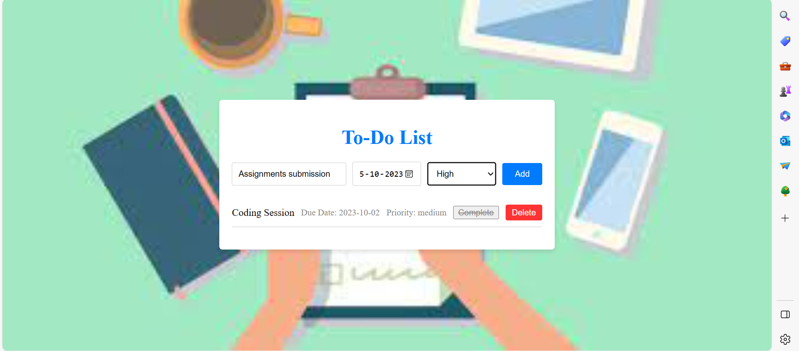

# To_Do_List
A simple and responsive To-Do List web application created using HTML, CSS, and JavaScript.
# To-Do List Web Application

A simple and responsive To-Do List web application created using HTML, CSS, and JavaScript.

## Features

- Add tasks with due dates and priority levels.
- Mark tasks as complete.
- Delete tasks from the list.

## Preview

You can view a live demo of the project [here](https://your-demo-link.com).

## Installation

1. Clone the repository or download the ZIP file.

2. Open `index.html` in your web browser to use the application locally.

## Usage

- Enter a task description in the "Add a new task..." input field.
- Optionally, specify a due date and select a priority level.
- Click the "Add" button to add the task to the list.
- Click the checkbox next to a task to mark it as complete.
- Click the "Delete" button to remove a task from the list.

## Contributing

Contributions are welcome! Feel free to open issues or pull requests for any improvements or bug fixes.

## License

This project is open-source and is distributed under the MIT License.

## Acknowledgments

- Inspiration: 
- Background Image: [https://www.workflowmax.com/hubfs/6-things-to-do-list.png]

Overview
The To-Do List Web Application is a straightforward yet versatile task management tool designed to help users organize their daily tasks, assignments, and activities efficiently. It offers a clean and user-friendly interface that allows users to add, track, and manage tasks effortlessly.

Features
Task Management
Add New Tasks: Quickly add new tasks by typing the task description into the input field and pressing the "Add" button. Optionally, set a due date and select a priority level for each task.

Complete Tasks: Mark tasks as complete by clicking the checkbox next to each task. Completed tasks are visually distinguished by a strikethrough effect.

Delete Tasks: Easily remove tasks from the list that are no longer relevant or necessary by clicking the "Delete" button associated with each task.

Priority and Due Dates
Priority Levels: Categorize your tasks by priority with three levels: Low, Medium, and High. This feature allows you to focus on high-priority tasks first while keeping lower-priority tasks organized.

Due Dates: Assign due dates to your tasks to stay on top of deadlines. The due date is displayed alongside each task, helping you manage your time effectively.

